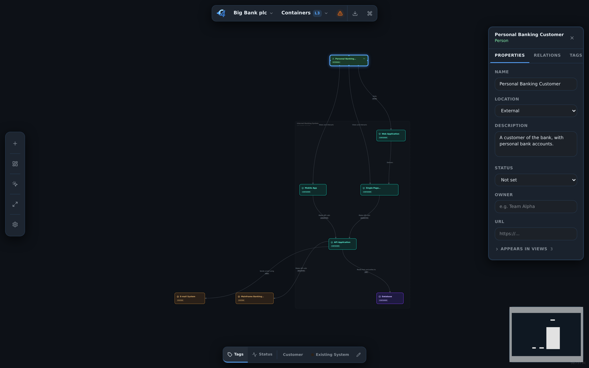

# c4hero

[](https://github.com/c4hero/c4hero/actions/workflows/ci.yml)
[](LICENSE)
[](https://github.com/c4hero/c4hero/releases)
[](#local-development)

> A visual GUI for designing C4 architecture diagrams. Saves to plain Structurizr DSL in your repo. Local-first, Apache-2.0, no signup.

*I built c4hero because I wanted to design C4 diagrams in a real editor — drag, drop, connect — and still get Structurizr's portable plain-text format on disk.*

**Try it: [c4hero.com](https://c4hero.com) · Open the app: [app.c4hero.com](https://app.c4hero.com)**



---

## The 30-second pitch

Design C4 diagrams visually — drop people, software systems, and containers onto the canvas, wire up relationships, and let auto-layout handle the rest. c4hero saves your work as plain Structurizr DSL:

```dsl
workspace "E-Commerce Platform" {
  model {
    customer = person "Customer" "Browses + buys"
    platform = softwareSystem "E-Commerce Platform" {
      apiGateway = container "API Gateway" "Routes + auth" "Node.js"
      userService = container "User Service" "Accounts + profiles" "Spring Boot"
      orderService = container "Order Service" "Cart + checkout" "Go"
      postgres = container "Postgres" "Users + orders" "Database"
    }
    customer -> apiGateway "Browses"
    apiGateway -> userService "Authenticates"
    apiGateway -> orderService "Routes"
    userService -> postgres "Reads + writes"
    orderService -> postgres "Reads + writes"
  }
  views { container platform "Containers" { include * } }
}
```

You never have to write that by hand — but you can. Already have a `.dsl` file? Open it and keep editing; c4hero round-trips Structurizr DSL both ways. Your architecture lives in your repo, reviews in pull requests, and never gets locked behind a vendor's login screen.

## Why c4hero

- **Local-first.** Files stay on your device. There is no c4hero server. No accounts, no syncing, and no telemetry unless a hosted deployment explicitly enables privacy-preserving analytics or error reporting.
- **Plain text.** `.dsl` files diff cleanly in git, review in PRs, and survive any tool you use after this one.
- **Structurizr-compatible.** Read and write the same DSL the official Structurizr tools use — c4hero is one option in an interoperable ecosystem, not a fork.
- **Fast.** Code-split bundle, idle-scheduled autosave, dagre auto-layout, no network round-trips during editing.
- **Accessible.** Focus-trap dialogs, ARIA-labeled canvas, keyboard shortcuts for every common action, `prefers-reduced-motion` support.
- **Optional AI, bring-your-own-key.** An opt-in assistant shows an instant **model-health** readout, walks you through **guided cleanup** of missing descriptions/technologies/links, runs a **deep review** of your architecture, **interviews** you to fill in a view, scans a **local repo** to propose elements, builds or edits the model from a **plain-English** prompt, and auto-suggests inspector fields — all reviewed before anything is applied. Every text box also supports **voice-to-text** dictation. Bring your own **Anthropic, OpenAI, or Google Gemini** API key (the provider layer is pluggable for adding more). Your key is stored only in your browser and sent only to that provider — c4hero never sees it, and nothing runs until you opt in. Open it from the tool rail, the menu, or the command palette ("AI: …").

A more detailed feature catalogue lives in [`docs/FEATURES.md`](docs/FEATURES.md).

## Browser support

c4hero runs in any modern browser. **Folder collections** rely on the [File System Access API](https://developer.mozilla.org/en-US/docs/Web/API/File_System_Access_API), which is currently only available in Chromium browsers (Chrome, Edge, Brave, Arc, Opera).

In Firefox and Safari you can still open and edit a single `.dsl` file at a time, export PNG / SVG / DSL, and use every other feature. When folder workflows aren't supported, c4hero automatically falls back to the single-file flow.

## Local development

### Prerequisites

- Node.js 22+
- npm 10+
- Playwright browsers for E2E tests: `npx playwright install chromium`

### Run locally

```bash
npm install
npm run dev
```

The Vite dev server runs on `http://localhost:3004` with `strictPort: true`.

### Available commands

```bash
npm run dev          # dev server with HMR
npm run build        # production bundle in dist/
npm run preview      # serve the production bundle
npm run typecheck    # tsc -b
npm run lint         # eslint
npm test             # unit tests with Vitest
npm run test:unit    # vitest only
npm run test:watch   # vitest in watch mode
npm run test:e2e     # playwright only
npm run audit        # npm audit (production)
npm run check        # lint + typecheck + unit tests + build
```

### Package distribution

c4hero is distributed as a source-available static app, not as an npm package. `package.json` is marked `private` to prevent accidental `npm publish` while still using npm for local development, CI, and builds.

## Deployment

Deployment guidance — Vercel pipeline, env-var expectations, security headers for self-hosting — is documented in [`docs/DEPLOYMENT.md`](docs/DEPLOYMENT.md).

## Privacy

c4hero is local-first. Workspaces stay on your device; nothing is uploaded to a c4hero server. The open source build has hosted observability off by default; `app.c4hero.com` may enable Cloudflare Web Analytics for aggregate usage counts and Sentry for scrubbed error reports. Full details in [`PRIVACY.md`](PRIVACY.md).

## Changelog

See [`CHANGELOG.md`](CHANGELOG.md) for a list of notable changes. The current release is tagged in [GitHub Releases](https://github.com/c4hero/c4hero/releases).

## Maintenance

c4hero is maintained by one person in their spare time. I aim to respond to issues within a week. If something is broken, please include browser, OS, and a minimal `.dsl` snippet so I can reproduce — the bug template will prompt you. PRs that come with tests get reviewed first.

## Contributing

Contributions are welcome. Start with [`CONTRIBUTING.md`](CONTRIBUTING.md) for setup, workflow, and testing guidance, and please follow the [Code of Conduct](CODE_OF_CONDUCT.md).

To report a security issue, see [`SECURITY.md`](SECURITY.md).

## License

Released under the [Apache License 2.0](LICENSE).

The c4hero name, logo, domain, and product identity are not licensed under Apache-2.0. See [TRADEMARKS.md](TRADEMARKS.md) for the brand-use boundary.
